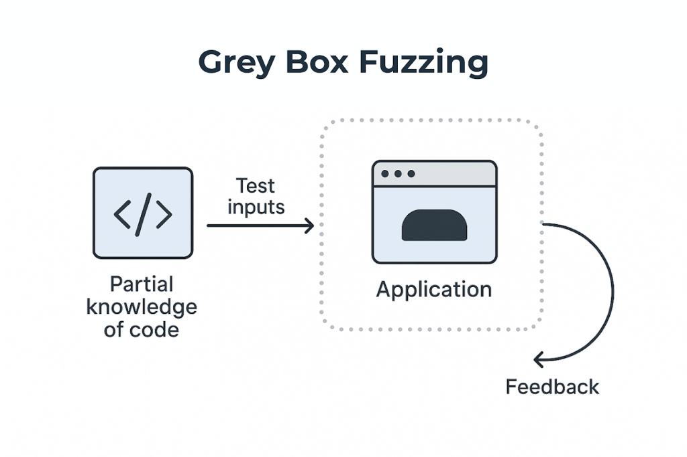

## 1. 퍼징(Fuzzing)이란?

퍼징은 **자동화된 소프트웨어 테스팅 기법**입니다.
대상 프로그램에 예상치 못한 무작위·변형 입력을 대량으로 주입하여 크래시, 메모리 오류, 보안 취약점 등을 찾아내는 **행위(방법론)** 자체를 의미합니다.

### 퍼징의 기본 동작 흐름

```
Seed Corpus → Mutator → Target 실행 → Oracle (오류 감지)
     ▲                                        │
     └──────────── Coverage 피드백 ─────────────┘
```

---

## 2. 퍼징의 종류

### 2-1. 블랙박스 퍼징 (Black-box Fuzzing)

소스코드나 내부 구조 정보 없이 순수하게 랜덤 입력을 생성해 테스트하는 방식입니다.

- 프로그램 내부를 몰라도 적용 가능
- 구현이 단순하고 빠르게 시작 가능
- 코드 커버리지가 낮아 깊은 경로 탐색이 어려움

### 2-2. 그레이박스 퍼징 (Grey-box Fuzzing)

프로그램에 계측(Instrumentation)을 삽입해 코드 커버리지 피드백을 수집하고,
새로운 실행 경로를 여는 입력을 우선 변형하는 방식입니다.

- 속도와 정밀도의 균형이 뛰어남
- 소스 없이도 QEMU 등으로 바이너리 계측 가능
- **현재 가장 널리 사용되는 방식**


### 2-3. 화이트박스 퍼징 (White-box Fuzzing)

소스코드와 심볼릭 실행(Symbolic Execution), SMT 솔버를 결합해
프로그램의 모든 실행 경로를 수학적으로 탐색하는 방식입니다.

- 이론적으로 모든 분기 조건 커버 가능
- 경로 폭발(Path Explosion) 문제로 대규모 프로그램에 적용이 어려움
- 속도가 느리고 환경 구성이 복잡

### 퍼징 종류 비교

| 항목 | 블랙박스 | 그레이박스 | 화이트박스 |
|---|---|---|---|
| 소스코드 필요 | X | 권장 | O |
| 커버리지 피드백 | 없음 | 있음 | 있음 (정확) |
| 실행 속도 | 빠름 | 빠름 | 느림 |
| 경로 탐색 깊이 | 낮음 | 중간~높음 | 매우 높음 |
| 확장성 | 높음 | 높음 | 낮음 |

---

## 3. 퍼저(Fuzzer)란?

퍼저는 퍼징을 **실제로 수행하는 도구(소프트웨어)** 입니다.
퍼징이 "방법론"이라면, 퍼저는 그 방법론을 구현한 "도구" 자체입니다.

### 퍼저의 주요 구성 요소

| 구성 요소 | 역할 |
|---|---|
| Seed Corpus | 변형의 출발점이 되는 초기 입력 파일 모음 |
| Mutator | 시드를 비트 플립, 삽입, 삭제 등으로 변형해 새 입력 생성 |
| Instrumentation | 프로그램 실행 중 커버리지 정보를 수집하는 계측 모듈 |
| Oracle | 크래시, 행(hang), 메모리 오류 등 비정상 동작 감지 |
| Scheduler | 어떤 입력을 우선 변형할지 결정하는 우선순위 관리 |

---

## 4. 퍼징 vs 퍼저 차이점

| 구분 | 퍼징 (Fuzzing) | 퍼저 (Fuzzer) |
|---|---|---|
| **정의** | 자동화된 테스팅 기법·방법론 | 퍼징을 수행하는 소프트웨어 도구 |
| **성격** | 추상적인 개념, 행위 | 구체적인 구현체, 프로그램 |
| **예시** | "이 프로그램에 퍼징을 적용했다" | "AFL++로 퍼징을 실행했다" |
| **관계** | 퍼저가 수행하는 작업 | 퍼징을 실행하는 주체 |

> 한 줄 요약: **퍼징**은 취약점을 찾는 *방법*이고, **퍼저**는 그 방법을 실행하는 *도구*입니다.

---

## 5. 링크 소개 및 사용 상황

### 5-1. AFL++ (American Fuzzy Lop plus plus)

> https://github.com/AFLplusplus/AFLplusplus

Google AFL의 커뮤니티 상위 포크로, 현재 가장 널리 쓰이는 범용 그레이박스 퍼저입니다.
원본 AFL 대비 속도, 뮤테이션 전략, 계측 방식 등이 대폭 개선되었습니다.

**주요 특징**

| 항목 | 내용 |
|---|---|
| 계측 방식 | LLVM/GCC 컴파일 타임 계측 (`afl-cc`) |
| 바이너리 지원 | QEMU 모드, Frida 모드, Unicorn 모드 |
| 고급 뮤테이션 | CmpLog, LAF-intel, Redqueen |
| 스케줄링 전략 | MOpt, AFLfast++ 파워 스케줄 |
| 주요 플랫폼 | Linux 중심 (macOS 지원) |
| 라이선스 | Apache-2.0 |

**이런 상황에 사용합니다**

- 소스코드가 있는 C/C++ 프로그램의 취약점을 찾을 때
- Linux 환경에서 오픈소스 프로젝트를 퍼징할 때
- QEMU/Frida 모드로 바이너리만 있는 타깃을 퍼징할 때
- 임베디드 펌웨어를 Unicorn 모드로 퍼징할 때

```bash
# 소스가 있는 경우 컴파일 후 퍼징
CC=afl-cc CXX=afl-c++ ./configure --disable-shared && make
afl-fuzz -i seeds_dir -o output_dir -- ./target @@
```

---

### 5-2. Jackalope

> https://github.com/googleprojectzero/Jackalope

Google Project Zero가 개발한 바이너리 전용 커버리지 가이드 퍼저입니다.
소스코드 없이 클로즈드 바이너리를 퍼징하는 것에 특화되어 있으며,
특히 Windows·macOS 환경의 취약점 연구를 목적으로 설계되었습니다.

**주요 특징**

| 항목 | 내용 |
|---|---|
| 계측 방식 | TinyInst 런타임 동적 바이너리 계측 |
| 지원 플랫폼 | Windows, macOS, Linux, Android |
| 샘플 전달 | 파일 또는 공유 메모리(shmem) |
| 분산 퍼징 | 서버-클라이언트 아키텍처 내장 |
| 커스텀화 | `Fuzzer` 클래스 서브클래싱으로 컴포넌트 교체 가능 |
| 라이선스 | Apache-2.0 |

**이런 상황에 사용합니다**

- 소스코드가 없는 상용 소프트웨어(Windows·macOS 앱)를 퍼징할 때
- 여러 머신에 분산해 대규모 퍼징 인프라를 구성할 때
- 커스텀 프로토콜·포맷에 맞는 뮤테이터를 직접 구현할 때
- Android 바이너리 취약점을 연구할 때

```bash
# 빌드 후 실행 (macOS/Linux)
./fuzzer -in in -out out -t 1000 \
  -delivery shmem \
  -instrument_module target \
  -target_method fuzz \
  -nargs 1 -persist -loop \
  -- ./target @@
```

---

### 5-3. google/fuzzing

> https://github.com/google/fuzzing/tree/master

Google이 운영하는 퍼징 관련 **가이드, 튜토리얼, 모범 사례(Best Practices) 모음** 저장소입니다.
특정 퍼저 도구가 아니라 퍼징을 어떻게 잘 할 것인가에 대한 지식 베이스입니다.

**포함된 내용**

| 항목 | 내용 |
|---|---|
| 튜토리얼 | libFuzzer, AFL 기반 퍼징 시작 가이드 |
| 모범 사례 | 효과적인 시드 코퍼스 구성, 커버리지 최대화 방법 |
| FuzzBench | 퍼저 성능 비교 벤치마크 연동 정보 |
| 언어별 가이드 | C/C++, Rust, Go, Python 퍼징 방법 |

**이런 상황에 사용합니다**

- 퍼징을 처음 시작할 때 개념과 방법을 익힐 때
- 퍼징 전략을 개선하거나 모범 사례를 참고할 때
- 여러 언어·환경에서 퍼징을 적용하는 방법을 찾을 때

---

## 6. 세 도구 비교 요약

| 항목 | AFL++ | Jackalope | google/fuzzing |
|---|---|---|---|
| **종류** | 퍼저 (도구) | 퍼저 (도구) | 가이드 (지식 베이스) |
| **대상** | 소스 기반 + 바이너리 | 바이너리 전용 | 해당 없음 |
| **플랫폼** | Linux 중심 | Win·macOS·Linux·Android | 해당 없음 |
| **계측** | 컴파일 타임 (afl-cc) | 런타임 (TinyInst) | 해당 없음 |
| **사용 목적** | 범용 퍼징 | 클로즈드 바이너리 퍼징 | 학습·참고 |
| **난이도** | 중간 | 높음 (커스텀 필요) | 낮음 (읽기만 하면 됨) |

