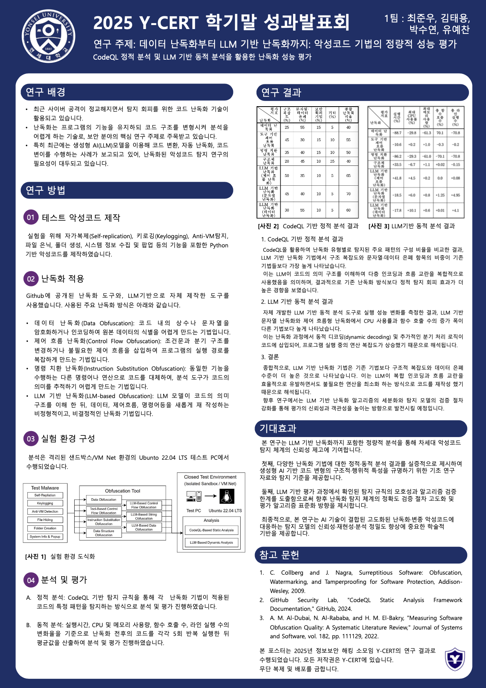
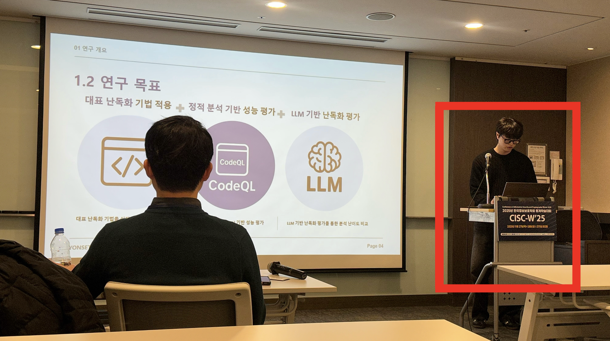

# 악성코드 난독화 성능 평가에 대한 연구: 데이터 난독화부터 LLM 기반 난독화까지
> 최준우, 김태용, 박수연, 유예찬(연세대학교), 최석환(연세대학교 교수님)

# 🎙️ 2025 CISC 동계학술대회(CISC-W) 구두 발표

지난 11월, **CISC 동계학술대회(CISC-W 2025)**에 참가하여 학부생 소속으로 연구 논문을 투고하고 **구두 발표(Oral Presentation)**를 무사히 마쳤습니다. 

이번 연구는 교내 정보보안 해킹 소모임 **Y-CERT** 팀원들(최준우, 김태용, 박수연, 유예찬)과 함께 진행한 프로젝트로, 최근 보안 분야의 핵심 연구 주제로 주목받는 'LLM(대형 언어 모델)'이 악성코드 난독화에 미치는 영향을 정량적으로 분석한 결과물입니다. 치열하게 고민했던 연구 내용과 그 결과를 블로그에 요약해 봅니다.

---

---

---

## 📝 연구 개요
* **논문명:** 데이터 난독화부터 LLM 기반 난독화까지: 악성코드 기법의 정량적 성능 평가 (CodeQL 정적 분석 및 LLM 기반 동적 분석을 활용한 난독화 성능 평가) 
* **소속:** 연세대학교 미래캠퍼스 소프트웨어학부 Y-CERT 소모임
* **저자:** 최준우, 김태용, 박수연, 유예찬 

---

## 1. 🔍 연구 배경 (Background)
최근 사이버 공격이 정교해지면서 탐지 회피를 위한 **코드 난독화(Obfuscation)** 기술이 활용되고 있습니다. 난독화는 프로그램의 기능을 유지하되 코드 구조를 변형시켜 분석을 어렵게 하는 기술입니다.

특히 최근에는 생성형 AI(LLM) 모델을 이용해 코드 변환, 자동 난독화, 코드 변이를 수행하는 사례가 보고되고 있어, 난독화된 악성코드 탐지 연구의 필요성이 대두되고 있습니다. 이에 저희 팀은 기존의 전통적인 도구 기반 난독화와 **'LLM 기반 난독화'**가 탐지 시스템에 어떤 차이를 만들어내는지 정량적으로 비교 분석해 보기로 했습니다.

## 2. 🛠️ 연구 및 실험 방법 (Methodology)

### Step 1. 테스트 악성코드(Malware) 직접 제작
실험을 위해 자가복제(Self-replication), 키로깅(Keylogging), Anti-VM 탐지, 파일 은닉, 폴더 생성, 시스템 정보 수집 및 팝업 등의 기능을 포함한 Python 기반 악성코드를 제작하였습니다.

### Step 2. 난독화 기법 적용
Github에 공개된 난독화 도구와, LLM 기반으로 자체 제작한 도구를 사용했습니다. 
* **적용 기법:** 원본 데이터의 식별을 어렵게 만드는 데이터 난독화 , 프로그램의 실행 경로를 복잡하게 만드는 제어 흐름 난독화, 코드를 대체하는 명령 치환 난독화, 그리고 모델이 코드의 의미 구조를 이해한 뒤 비정형적이고 비결정적으로 재작성하는 **LLM 기반 난독화**를 적용했습니다.

### Step 3. 실험 환경 및 분석 파이프라인
분석은 격리된 샌드박스/VM Net 환경의 Ubuntu 22.04 LTS 테스트 PC에서 수행되었습니다.
* **정적 분석:** `CodeQL` 기반 탐지 규칙을 통해 각 난독화 기법이 적용된 코드의 특정 패턴을 탐지하는 방식으로 분석 및 평가를 진행하였습니다.
* **동적 분석:** 자체 개발한 LLM 기반 동적 분석 도구를 활용하여 실행시간, CPU 및 메모리 사용량, 함수 호출 수, 라인 실행 수의 변화율을 기준으로 난독화 전후의 코드를 각각 5회 반복 실행한 뒤 평균값을 산출하여 분석 및 평가를 진행하였습니다.

---

## 3. 📊 주요 분석 결과 (Results)

### A. CodeQL 기반 정적 분석 결과
CodeQL을 활용하여 난독화 유형별로 탐지된 주요 패턴의 구성 비율을 비교한 결과, **LLM 기반 난독화 기법에서 구조 복잡도와 문자열 데이터 은폐 항목의 비중이 기존 기법들보다 가장 높게** 나타났습니다. 이는 LLM이 코드의 의미 구조를 이해하여 다중 인코딩과 흐름 교란을 복합적으로 사용했음을 의미하며, 결과적으로 기존 난독화 방식보다 정적 탐지 회피 효과가 더 높은 경향을 보였습니다.

### B. LLM 기반 동적 분석 결과
실행 성능 변화를 측정한 결과, LLM 기반 문자열 난독화와 제어 흐름형 난독화에서 CPU 사용률과 함수 호출 수의 증가 폭이 다른 기법보다 높게 나타났습니다. 이는 난독화 과정에서 동적 디코딩(dynamic decoding) 및 추가적인 분기 처리 로직이 코드에 삽입되어, 프로그램 실행 중의 연산 복잡도가 상승했기 때문으로 해석됩니다.

---

## 4. 💡 결론 및 의의 (Conclusion)

종합적으로, **LLM 기반 난독화 기법은 기존 기법보다 구조적 복잡도와 데이터 은폐 수준이 더 높은 것**으로 나타났습니다. 이는 LLM이 복합 인코딩과 흐름 교란을 효율적으로 유발하면서도 불필요한 연산을 최소화하는 방식으로 코드를 재작성했기 때문으로 해석됩니다.

본 연구는 다양한 난독화 기법에 대한 정적·동적 분석 결과를 실증적으로 제시하여 생성형 AI 기반 코드 변형의 구조적·행위적 특성을 규명하기 위한 기초 연구 자료와 탐지 기준을 제공합니다. 또한, 탐지 규칙의 모호성과 알고리즘 검증 한계를 도출함으로써 향후 난독화 탐지 체계의 정확도 검증 절차 고도화 및 평가 알고리즘 표준화 방향을 제시합니다.

---

## 5. 🚀 향후 연구 계획 (Future Work)

본 연구는 LLM 기반 난독화까지 포함한 정량적 분석을 통해 차세대 악성코드 탐지 체계의 신뢰성 제고에 기여합니다. 

이번 CISC-W 2025 구두 발표에서 얻은 인사이트를 바탕으로, 향후 연구에서는 **LLM 기반 난독화 알고리즘의 세분화**와 **탐지 모델의 검증 절차 강화**를 통해 평가의 신뢰성과 객관성을 높이는 방향으로 지속 발전시킬 예정입니다. 최종적으로, 고도화된 난독화 및 변종 악성코드에 대응하는 탐지 모델의 신뢰성·재현성·분석 정밀도 향상에 기여하는 연구를 이어가겠습니다.