## 목표
진로에 중요한 가치와 우선순위를 정하고 시장 분석을 통해 인사이트를 도출.

---

## 진로 가치관 및 우선순위

* **최우선 가치 (가장 중요한 것):** 워라밸, 성장 가능성
* **최하위 가치 (우선순위가 낮은 것):** 근무 지역, 조직 문화
> **💡 Insight:** 어디서 일하는지, 조직의 분위기가 어떤지보다는 **'내 개인의 시간(워라밸)을 지키면서 직업적으로 성장할 수 있는지'**가 직장 선택의 핵심 기준임.

---

## 시장 분석

### (1) Target 기업 Top 3
1. **현대자동차**
2. **삼성 (Samsung)**
3. **SK**

---

### (2) 희망 직무 관련 공고 분석

#### [공고 1] 현대자동차 - [**Mobility Security Engineer**]
* **회사명:** 현대자동차
* **공고 링크:** [https://talent.hyundai.com/apply/applyView.hc?recuYy=2026&recuType=N2&recuCls=40](https://talent.hyundai.com/apply/applyView.hc?recuYy=2026&recuType=N2&recuCls=40)
* **캡처본:**
  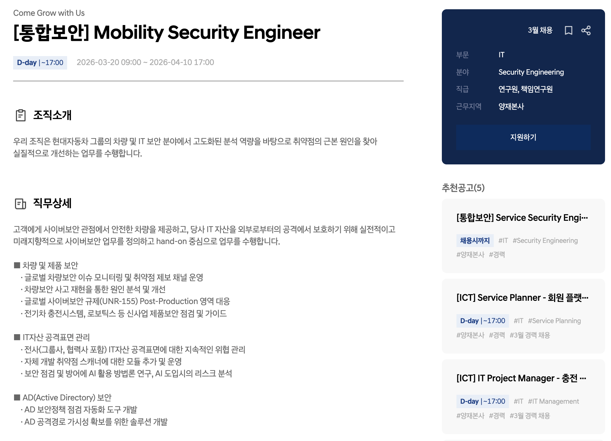
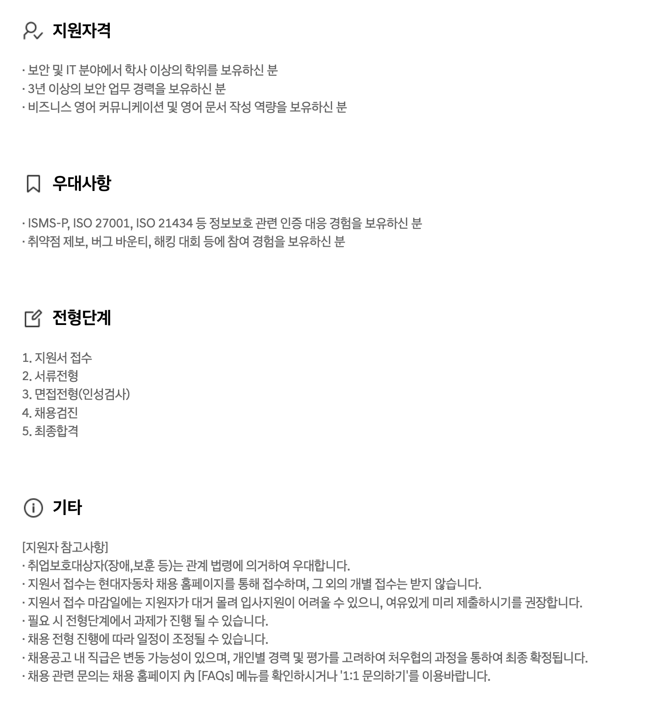

---

#### [공고 2] 현대자동차 - [**Service Security Engineer**]
* **회사명:** 현대자동차
* **공고 링크:** [https://talent.hyundai.com/apply/applyView.hc?recuYy=2025&recuType=N2&recuCls=245](https://talent.hyundai.com/apply/applyView.hc?recuYy=2025&recuType=N2&recuCls=245)
* **캡처본:**
  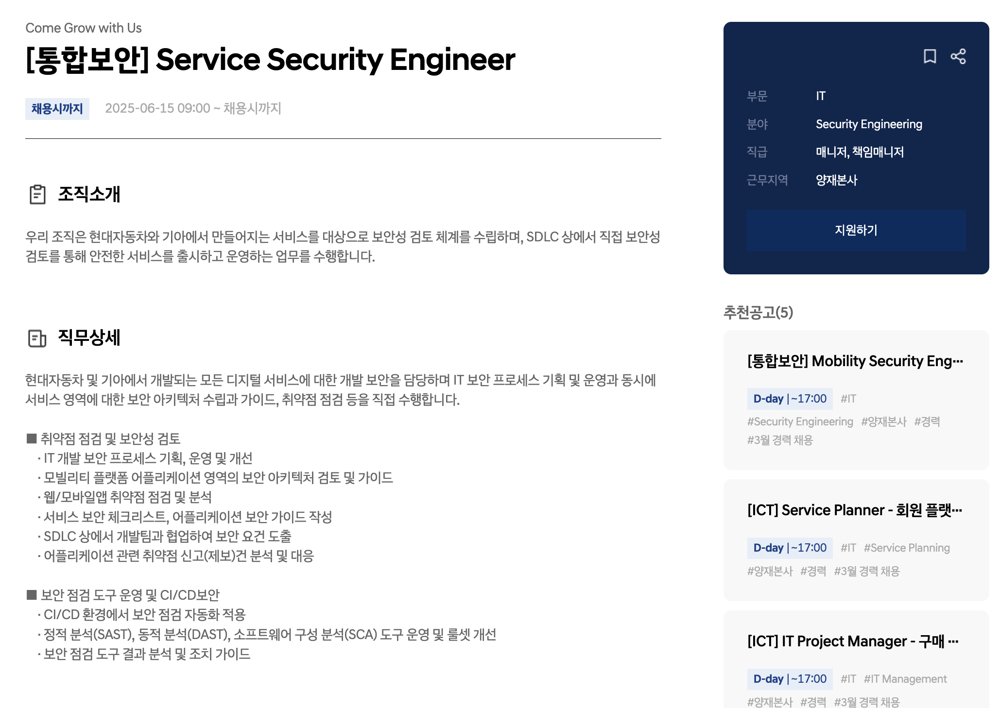
  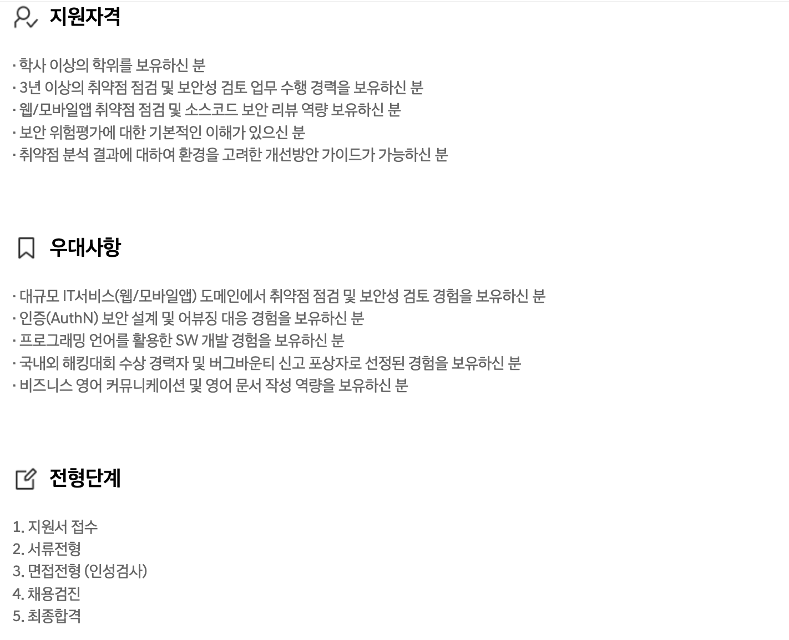

---

#### [공고 3] SK바이오택 - [**보안 기획 담당자**]
* **회사명:** SK바이오택
* **공고 링크:** [https://www.skcareers.com/Recruit/Detail/R260735](https://www.skcareers.com/Recruit/Detail/R260735)
* **캡처본:**
  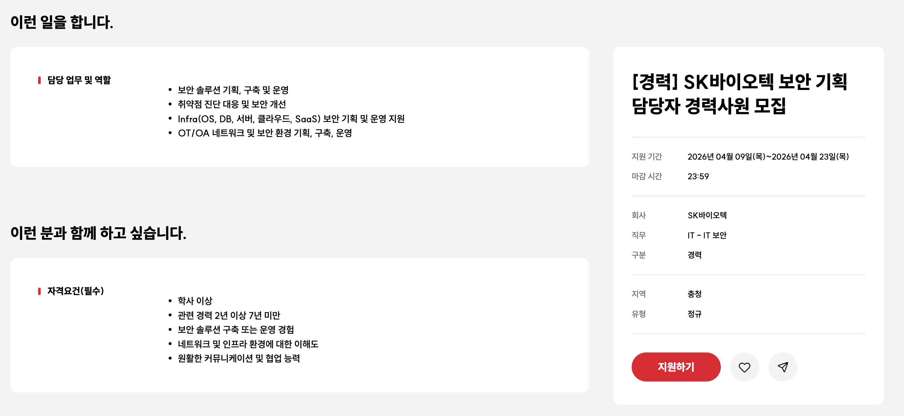
  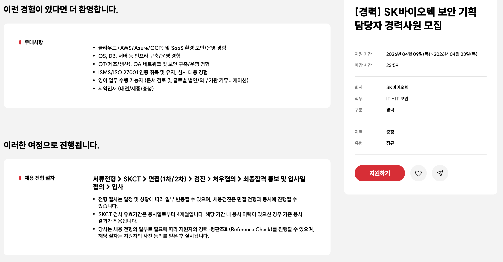

---

#### [공고 4] [SK주식회사(AX)] - [**보안 아키텍트**]
* **회사명:** [SK주식회사(AX)]
* **공고 링크:** [https://www.skcareers.com/Recruit/Detail/R260542](https://www.skcareers.com/Recruit/Detail/R260542)
* **캡처본:**
  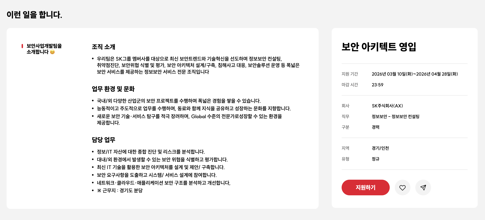
  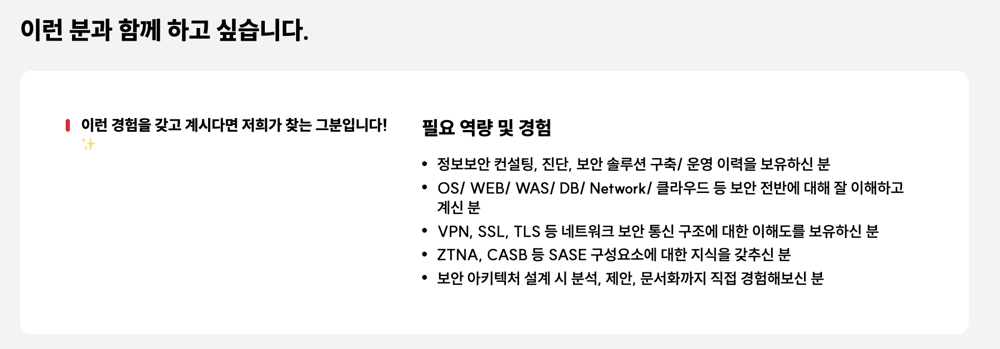
  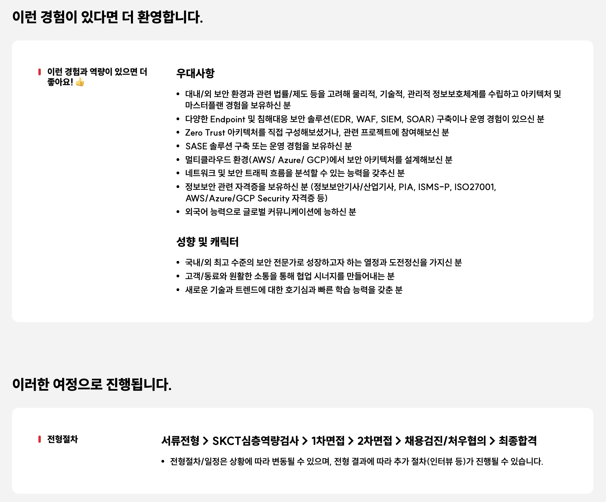

---

#### [공고 5] [SK주식회사(AX)] - [IT보안 전문가]
* **회사명:** [SK주식회사(AX)]
* **공고 링크:** [https://www.skcareers.com/Recruit/Detail/R260543](https://www.skcareers.com/Recruit/Detail/R260543)
* **캡처본:**
  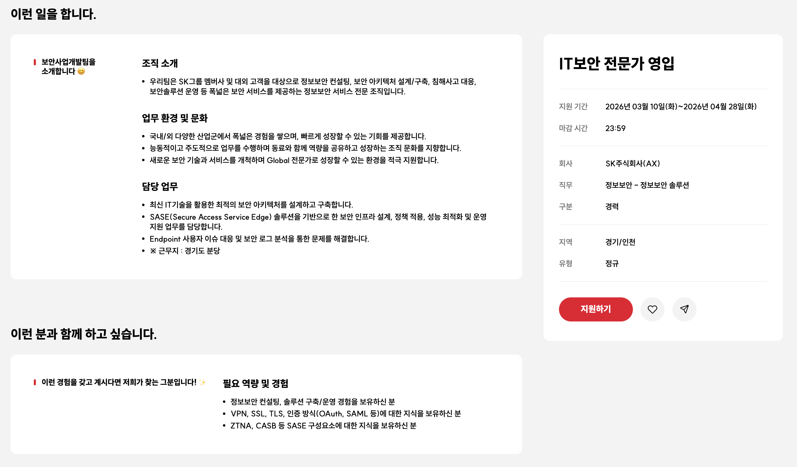
  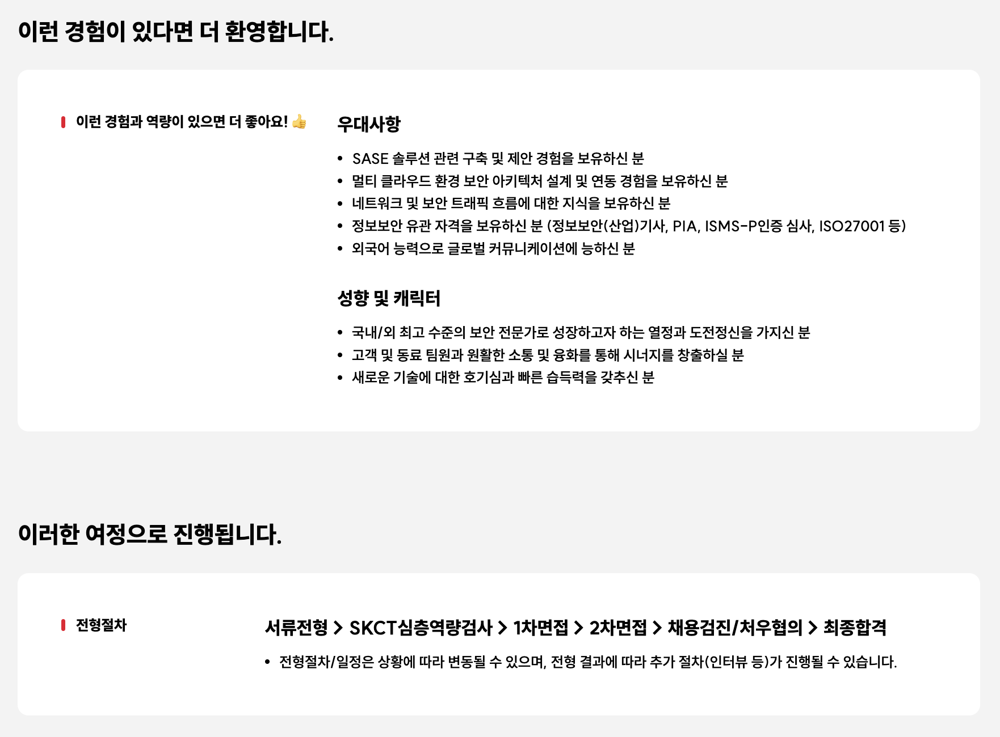

---

### (3) 공통 역량 도출 및 Action Plan

#### 🔍 공고에서 반복해서 요구하는 핵심 역량
1. **클라우드 및 네트워크 보안/아키텍처 역량:** 멀티 클라우드(AWS/Azure/GCP) 환경의 이해, 웹/앱 취약점 분석, 그리고 ZTNA, SASE, VPN 등 네트워크 통신 구조에 대한 전문 지식
2. **오펜시브 시큐리티 및 실전 해킹 역량:** 버그바운티 참여, 해킹 방어 대회(CTF) 수상, 취약점 제보 등 실전 공격 기법에 대한 이해도
3. **비즈니스 영어 커뮤니케이션:** 기술 문서 검토, 영어 문서 작성 및 글로벌 법인/외부기관과의 원활한 소통 능력

#### 🚀 내가 지금 당장 해야 할 것 1가지 (Action Item)
* 버그바운티(HackerOne, Bugcrowd 등)에 도전하여 실전 취약점을 분석하고 영문 제보 리포트 작성하기

    * 무거운 클라우드 인프라를 처음부터 직접 구축하는 대신, 공고에서 요구하는 '웹/앱 취약점 분석' 역량에 집중할 계획이다. 실제 운영 중인 타겟 시스템을 대상으로 오펜시브 시큐리티 기법을 적용해 보며 실전 해킹 감각을 키우고자 한다.

    * 취약점을 발견하면 발생 원인, 재현 과정(PoC), 그리고 완화 조치(Mitigation) 가이드를 글로벌 플랫폼 기준에 맞춰 직접 영문 리포트로 작성하고 이를 통해 실무 수준의 보안 분석 역량과 비즈니스 영어 문서 작성 능력을 한 번에 증명하는 포트폴리오로 만들겠다.