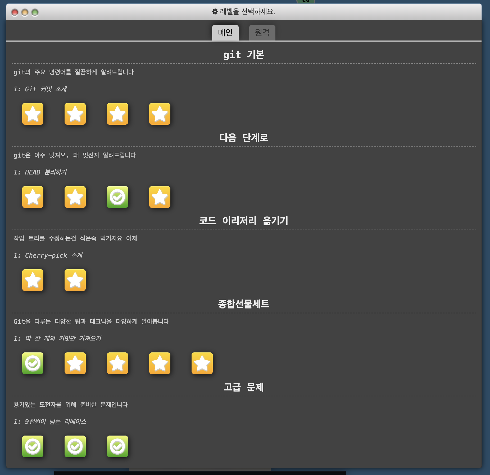
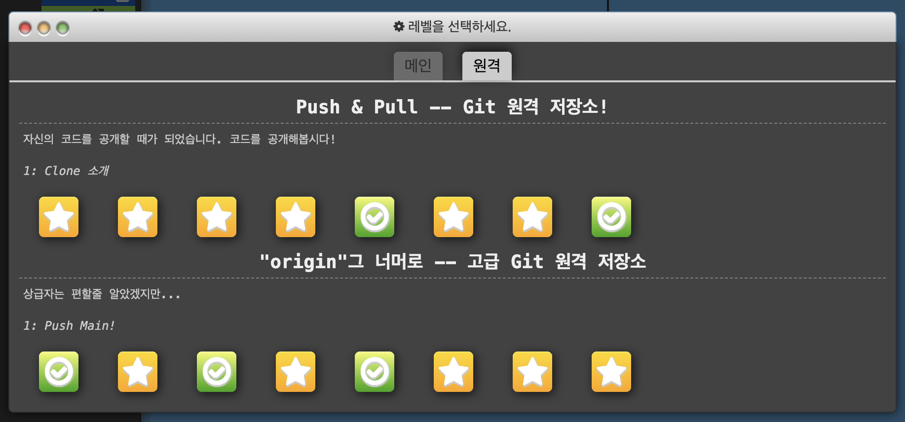

# Git 명령어 연습

## < [홈페이지](https://learngitbranching.js.org/?locale=ko) >   여기서 github 사용법을 익힐 수 있었다.
<br>
<br>

> 연습 모드에서 쓸 수 있는 다양한 git명령어는 다음과 같습니다
```
commit
branch
checkout
cherry-pick
reset
revert
rebase
merge
```





### 1. 작업 저장 및 분기 (Basic & Branching)
이 명령어들은 프로젝트의 버전을 기록하고, 독립적인 작업 공간을 만드는 데 사용됩니다.

- commit (저장하기)

  - 개념: 파일들의 현재 상태를 사진 찍듯이 찰칵(Snapshot) 기록으로 남기는 명령어입니다.

  - 비유: 게임의 '세이브 포인트'를 만드는 것과 같습니다. 언제든 이 커밋 시점으로 돌아갈 수 있습니다.

- branch (가지 치기)

  - 개념: 원본 코드를 해치지 않고 새로운 기능을 개발하거나 버그를 수정하기 위해 만드는 독립적인 작업 공간입니다.

  - 비유: 원본 세계와 똑같이 복제된 '평행 우주'를 만드는 것입니다. 이 우주에서 무슨 짓을 해도 원본 우주에는 영향을 주지 않습니다.

- checkout (이동하기)

  - 개념: 다른 브랜치로 작업 공간을 전환하거나, 특정 커밋 시점으로 이동할 때 사용합니다.

  - 참고: 최신 Git에서는 역할이 너무 많은 checkout 대신, 브랜치 이동은 switch, 파일 복구는 restore라는 명령어로 분리해서 사용하는 것을 권장합니다.

### 2. 브랜치 통합 (Integration)
나누어서 작업한 브랜치들을 다시 하나로 합칠 때 사용합니다.

- merge (병합하기)

  - 개념: 두 브랜치의 변경 사항을 하나로 합칩니다. 두 브랜치의 역사를 모두 유지하면서, 합쳐졌다는 새로운 '병합 커밋(Merge Commit)'을 남깁니다.

  - 특징: 작업 기록이 그대로 남아 추적이 쉽지만, 프로젝트 히스토리가 복잡해질 수 있습니다.

- rebase (베이스 재설정하기)

  - 개념: 내 브랜치의 시작점(Base)을 다른 브랜치의 최신 커밋으로 옮겨서, 마치 처음부터 그 최신 상태에서 작업한 것처럼 히스토리를 조작합니다.

  - 특징: 프로젝트 히스토리가 일직선으로 아주 깔끔해지지만, 이미 남들과 공유한 브랜치에서 사용하면 히스토리가 꼬일 수 있어 주의가 필요합니다.

### 3. 특정 커밋 다루기 (Selective Application)
전체를 합치는 것이 아니라, 원하는 부분만 골라낼 때 사용합니다.

- cherry-pick (체리 피킹)

  - 개념: 다른 브랜치에 있는 여러 커밋 중, 내가 딱 원하는 특정 커밋 하나(또는 여러 개)만 쏙 뽑아서 현재 내 브랜치에 적용하는 명령어입니다.

  - 비유: 바구니에 담긴 과일 중 가장 맛있어 보이는 체리만 골라오는 것과 같습니다. (예: 릴리스 브랜치에 급한 버그 수정 커밋만 가져와야 할 때 사용)

### 4. 되돌리기 (Undoing Changes)
실수를 했거나 이전 상태로 복구해야 할 때 사용합니다. 두 명령어의 차이를 아는 것이 매우 중요합니다.

- reset (시간 되돌리기)

  - 개념: 현재 브랜치의 시점을 과거의 특정 커밋으로 강제로 되돌립니다. 돌아간 시점 이후의 미래 커밋 기록은 히스토리에서 삭제됩니다.

  - 옵션: --hard(변경 사항 다 날림), --mixed(변경 사항은 남기되 unstage 상태), --soft(변경 사항을 stage 상태로 남김) 옵션이 있습니다.

- revert (작업 취소하기)

  - 개념: 특정 커밋에서 했던 작업을 정반대로 취소하는 새로운 커밋을 생성합니다. 과거의 기록을 삭제하지 않습니다.

  - 특징: 이미 GitHub 등 원격 저장소에 올라가 팀원들과 공유된 커밋을 되돌릴 때는 히스토리를 조작하는 reset 대신, 반드시 안전한 revert를 사용해야 합니다.