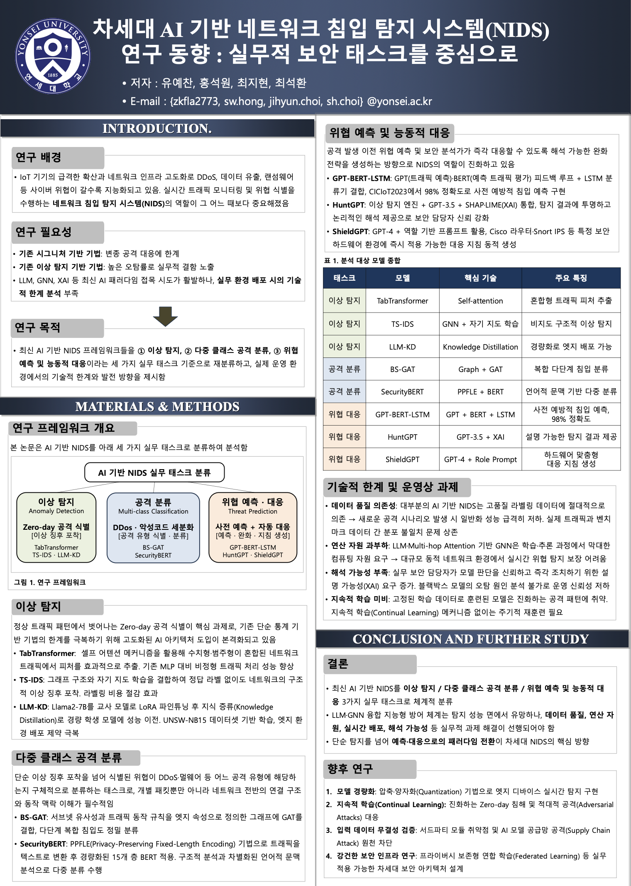

## KIIS에 논문을 투고하고 포스터 발표를 진행하였다.

---

## 1. 서론 (Introduction)

### 연구 배경
IoT 기기의 급격한 확산과 네트워크 인프라 고도화로 DDoS, 데이터 유출, 랜섬웨어 등 사이버 위협이 갈수록 지능화되고 있음. 실시간 트래픽 모니터링 및 위협 식별을 수행하는 **네트워크 침입 탐지 시스템(NIDS)**의 역할이 그 어느 때보다 중요해졌음.

> **위협 현황 수치**
> - 2024년 전 세계 DDoS 공격 건수: 전년 대비 **108% 증가** (StormWall, 2025)
> - 2024년 IoT 악성코드 공격: 전년 대비 **107% 급증** (SonicWall, 2024)
> - 2024년 Cloudflare가 차단한 DDoS 공격: **2,130만 건** (매 시간 평균 4,870건)
> - DDoS 공격 1분당 평균 피해액: **$6,000** (Zayo, 2024)

### 연구 필요성
- **기존 시그니처 기반 기법:** 사전에 정의된 패턴에만 의존 → 변종·Zero-day 공격 대응 불가
- **기존 이상 탐지 기반 기법:** 높은 오탐률(False Positive)로 실무 현장에서 신뢰성 저하
- LLM, GNN, XAI 등 최신 AI 패러다임 접목 시도가 활발하나, **실무 환경 배포 시의 기술적 한계 분석** 부족
- 탐지를 넘어 **분류 → 예측 → 능동 대응**으로 이어지는 통합 프레임워크 필요

### 연구 목적
최신 AI 기반 NIDS 프레임워크들을 **세 가지 핵심 실무 보안 태스크** 기준으로 재분류하고, 실제 운영 환경에서의 기술적 한계와 미래 발전 방향을 도출함.

### 본 연구의 기여 (Contribution)
- 기존 연구들을 **실무 태스크 중심**으로 체계적으로 재분류한 서베이 관점 분석
- 각 모델의 **실제 운영 환경 배포 가능성** 기준의 한계 도출
- 차세대 보안 아키텍처를 위한 **구체적 연구 방향** 제시

---

## 2. 본론 (Methods & Analysis)

### 연구 프레임워크 개요

본 논문은 AI 기반 NIDS를 아래 세 가지 실무 태스크로 분류하여 분석함.

[이상 탐지] → [다중 클래스 공격 분류] → [위협 예측 및 능동 대응]
Zero-day 식별 → DDoS/악성코드 세분화 → 사전 예측 + 자동 대응 지침 생성

### 2.1 이상 탐지 (Anomaly Detection)

정상 트래픽 패턴에서 벗어나는 Zero-day 공격 식별이 핵심 과제로, 기존 단순 통계 기반 기법의 한계를 극복하기 위해 고도화된 AI 아키텍처 도입이 본격화되고 있다.

- **TabTransformer** [7]: 셀프 어텐션 메커니즘을 활용해 수치형·범주형이 혼합된 네트워크 트래픽에서 피처를 효과적으로 추출. 기존 MLP 대비 비정형 트래픽 처리 성능 향상
- **TS-IDS** [4]: 그래프 구조와 자기 지도 학습(Self-supervised Learning)을 결합하여 정답 라벨 없이도 네트워크의 구조적 이상 징후 포착. 라벨링 비용 절감 효과
- **LLM-KD** [8]: Llama2-7B를 교사 모델로 LoRA 파인튜닝 후 지식 증류(Knowledge Distillation)로 경량 학생 모델에 성능 이전. UNSW-NB15 데이터셋 기반 학습, 엣지 환경 배포 제약 극복

### 2.2 다중 클래스 공격 분류 (Multi-class Attack Classification)

단순 이상 징후 포착을 넘어 식별된 위협이 DDoS·멀웨어 등 어느 공격 유형에 해당하는지 구체적으로 분류하는 태스크로, 개별 패킷뿐만 아니라 네트워크 전반의 연결 구조와 동작 맥락 이해가 필수적이다.

- **BS-GAT** [5]: 서브넷 유사성과 트래픽 동작 규칙을 엣지 속성으로 정의한 그래프에 GAT를 결합. 단일 패킷 분석의 한계를 넘어 다단계 복합 침입까지 정밀 분류
- **SecurityBERT** [3]: PPFLE(Privacy-Preserving Fixed-Length Encoding) 기법으로 트래픽을 텍스트로 변환 후 1,100만 파라미터로 경량화된 15개 층 BERT 적용. 구조적 분석과 차별화된 언어적 문맥 분석으로 다중 분류 수행

### 2.3 위협 예측 및 능동적 대응 (Threat Prediction & Proactive Response)

공격 발생 이전 위협 예측 및 보안 분석가가 즉각 대응할 수 있도록 해석 가능한 완화 전략을 생성하는 방향으로 NIDS의 역할이 진화하고 있다.

- **GPT-BERT-LSTM** [2]: GPT(미래 트래픽 예측)·BERT(예측 트래픽 평가) 피드백 루프 + LSTM 분류기 결합. CICIoT2023 데이터셋에서 **98% 정확도**로 사전 예방적 침입 예측 구현
- **HuntGPT** [1]: 이상 탐지 엔진 + GPT-3.5 + SHAP·LIME(XAI) 통합. 탐지 결과에 투명하고 논리적인 해석 제공 → 보안 담당자의 즉각적 판단 지원 및 신뢰 강화
- **ShieldGPT** [6]: GPT-4 + 역할 기반 프롬프트(Role-based Prompts) 활용. Cisco 라우터·Snort IPS 등 특정 보안 하드웨어 환경에 즉시 적용 가능한 대응 지침 동적 생성

### 2.4 분석 대상 모델 종합

| 태스크 | 모델 | 핵심 기술 | 주요 특징 |
|--------|------|-----------|-----------|
| 이상 탐지 | TabTransformer [7] | Self-attention | 혼합형 트래픽 피처 추출 |
| 이상 탐지 | TS-IDS [4] | GNN + 자기 지도 학습 | 비지도 구조적 이상 탐지 |
| 이상 탐지 | LLM-KD [8] | Knowledge Distillation | 경량화로 엣지 배포 가능 |
| 공격 분류 | BS-GAT [5] | Graph + GAT | 복합 다단계 침입 분류 |
| 공격 분류 | SecurityBERT [3] | PPFLE + BERT | 언어적 문맥 기반 다중 분류 |
| 위협 대응 | GPT-BERT-LSTM [2] | GPT + BERT + LSTM | 사전 예방적 침입 예측, **98% 정확도** |
| 위협 대응 | HuntGPT [1] | GPT-3.5 + XAI | 설명 가능한 탐지 결과 제공 |
| 위협 대응 | ShieldGPT [6] | GPT-4 + Role Prompt | 하드웨어 맞춤형 대응 지침 생성 |

---

## 3. 기술적 한계 및 운영상 과제 (Technical Limitations)

- **데이터 품질 의존성:** 대부분의 AI 기반 NIDS는 고품질 라벨링 데이터에 절대적으로 의존 → 새로운 공격 시나리오 발생 시 일반화 성능 급격히 저하. 실제 트래픽과 벤치마크 데이터 간 분포 불일치 문제 상존
- **연산 자원 과부하:** LLM·Multi-hop Attention 기반 GNN은 학습·추론 과정에서 막대한 컴퓨팅 자원 요구 → 대규모 동적 네트워크 환경에서 실시간 위협 탐지 보장 어려움
- **해석 가능성 부족:** 실무 보안 담당자가 모델 판단을 신뢰하고 즉각 조치하기 위한 설명 가능성(XAI) 요구 증가. 블랙박스 모델의 오탐 원인 분석 불가로 운영 신뢰성 저하
- **지속적 학습 미비:** 고정된 학습 데이터로 훈련된 모델은 진화하는 공격 패턴에 취약. 지속적 학습(Continual Learning) 메커니즘 없이는 주기적 재훈련 필요

---

## 4. 결론 및 향후 연구 (Conclusion & Further Study)

### 결론
- 최신 AI 기반 NIDS를 **이상 탐지 / 다중 클래스 공격 분류 / 위협 예측 및 능동적 대응** 3가지 실무 태스크로 체계적 분류
- LLM·GNN 융합 지능형 방어 체계는 탐지 성능 면에서 유망하나, **데이터 품질, 연산 자원, 실시간 배포, 해석 가능성** 등 실무적 과제 해결이 선행되어야 함
- 단순 탐지를 넘어 **예측·대응으로의 패러다임 전환**이 차세대 NIDS의 핵심 방향

### 향후 연구 방향
1. **모델 경량화:** 압축·양자화(Quantization) 기법으로 엣지 디바이스 실시간 탐지 구현
2. **지속적 학습(Continual Learning):** 진화하는 Zero-day 침해 및 적대적 공격(Adversarial Attacks) 대응
3. **입력 데이터 무결성 검증:** 서드파티 모듈 취약점 및 AI 모델 공급망 공격(Supply Chain Attack) 원천 차단
4. **강건한 보안 인프라 연구:** 프라이버시 보존형 연합 학습(Federated Learning) 등 실무 적용 가능한 차세대 보안 아키텍처 설계

---

## 참고 문헌 (References)

[1] Ali, T., and P. Kostakos. "HuntGPT: Integrating machine learning-based anomaly detection and explainable AI with large language models." arXiv:2309.16021 (2023).  
[2] Diaf, A., et al. "Beyond detection: Leveraging large language models for cyber attack prediction in IoT networks." Proc. 20th Int. Conf. DCOSSIoT, IEEE, 2024.  
[3] Ferrag, M. A., et al. "Revolutionizing cyber threat detection with large language models: A privacy-preserving Bert-based lightweight model for iot/iiot devices." IEEE Access (2024).  
[4] Nguyen, H., and R. Kashef. "TS-IDS: Traffic-aware self-supervised learning for IoT network intrusion detection." Knowl.-Based Syst. 279 (2023): 110966.  
[5] Wang, Y., et al. "BS-GAT behavior similarity based graph attention network for network intrusion detection." arXiv:2304.07226 (2023).  
[6] Wang, T., et al. "ShieldGPT: An LLM-based framework for DDoS mitigation." Proc. 8th Asia-Pac. Workshop Netw., 2024.  
[7] Wang, X., et al. "Advanced network intrusion detection with tabtransformer." J. Theory Pract. Eng. Sci. 4.03 (2024): 191-98.  
[8] Yang, Y., et al. "An anomaly detection model training method based on LLM knowledge distillation." Proc. Int. Conf. NaNA, IEEE, 2024.
