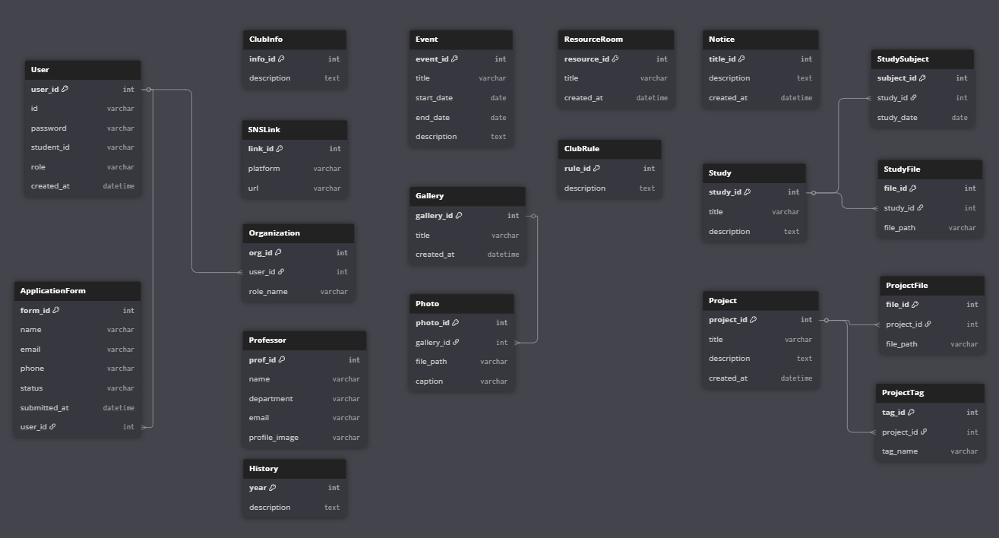

# 동아리 웹페이지 개발

> **💻 서비스 링크:** [Y-CERT 공식 웹페이지 (https://ycert.kr/)](https://ycert.kr/)

## 🚀 Y-CERT 웹페이지 제작 배경

현재 동아리를 소개하고 동아리원들이 원활하게 정보를 공유할 수 있는 공식 웹페이지가 부재했습니다. <br>
이를 해결하고자 희망하는 동아리원들과 함께 **Y-CERT 공식 웹페이지**를 직접 제작하게 되었습니다. 

보안 동아리라는 특성에 맞게 더 안전한 시스템 구조를 위해 **MVC 패턴**을 기반으로 `DMZ(웹사이트) - 중간망(API 서버) - 내부망(DB Server)`으로 망을 분리하여 아키텍처를 구성했습니다.

---

## 🙋‍♂️ 나의 역할 및 기여 (My Contribution)

이번 프로젝트에서 저는 **전체적인 UI/UX 디자인**과 사용자가 가장 먼저 마주하는 **메인 페이지**, 그리고 동아리 일정 관리를 위한 핵심 기능인 **캘린더 기능**을 전담하여 개발 및 운영했습니다.

* **🎨 전체 웹페이지 디자인 기획**
  * 보안 동아리의 정체성에 맞는 톤앤매너(Tone & Manner) 설정 및 전체 페이지 UI/UX 디자인 설계
* **🏠 메인 페이지 개발**
  * 사용자(부원 및 방문자)가 직관적으로 동아리 소식과 주요 기능을 파악할 수 있도록 프론트엔드 및 백엔드 구현
* **📅 일정 캘린더 개발 및 유지보수**
  * 동아리 내부 행사, 스터디 일정 등을 한눈에 확인할 수 있는 인터랙티브 캘린더 기능 설계 및 구현
  * 웹페이지 오픈 이후 발생하는 버그 픽스 및 사용자 피드백을 반영한 캘린더 기능 고도화(유지보수) 지속 진행

---

## 🛠️ Technology Stack


---

## 📑 목차
1. 주요 명령어
2. 기여자
3. 협업 방식
4. 개발 기간
5. ERD
6. 권한 설명

---

## 1. 주요 명령어 (Docker)
```bash
# 전체 서비스 시작
docker-compose up -d --build

# 전체 서비스 중지
docker-compose down

# 로그 확인
docker-compose logs -f [service-name]
```

## 2. 👏 기여자 표 (Project Team)

<h3>Project Team</h3>

<table>
  <thead>
    <tr>
      <th>Profile</th>
      <th>Role</th>
      <th>Expertise</th>
    </tr>
  </thead>
  <tbody>
    <tr>
      <td align="center">
        <a href="https://github.com/Ranunculus2165">
          <br/>
          woo.__.bee
        </a>
      </td>
      <td align="center">Project Manager</td>
      <td align="center">Database, 페이지 구현 </td>
    </tr>
    <tr>
      <td align="center">
        <a href="https://github.com/kimtaeyong730">
          <br/>
          kimtaeyong730
        </a>
      </td>
      <td align="center">Project Member</td>
      <td align="center">Database, 페이지 구현</td>
    </tr>
    <tr>
      <td align="center">
        <a href="https://github.com/yeon365">
          <br/>
          yeon365
        </a>
      </td>
      <td align="center">Project Member</td>
      <td align="center">페이지 구현</td>
    </tr>
    <tr>
      <td align="center">
        <a href="https://github.com/zkfla">
          <br/>
          zkfla
        </a>
      </td>
      <td align="center">Project Member</td>
      <td align="center">페이지 구현, 디자인</td>
    </tr>
    <tr>
      <td align="center">
        <a href="https://github.com/Maar-coding">
          <br/>
          Maar-coding
        </a>
      </td>
      <td align="center">Project Member</td>
      <td align="center">페이지 구현, 디자인</td>
    </tr>
  </tbody>
</table>

---

## 🔥 협업 방식

| 🖥️ 플랫폼 | 🛠️ 사용 방식 |
|-----------|--------------|
|  | 매주 화요일 19시 회의 |
|  | PR을 통해 변경사항 및 테스트 과정 확인 |
|  | 웹페이지 구성, API, 회의 기록 문서화 |

---
## 📆 개발 기간

- 2025.07.08 ~ 2025.07.15 : 웹페이지 구현 기능 회의 및 담당자 확정
- 2025.07.16 ~ 2025.07.21 : 기능 명세서 및 API 명세서, ERD 작성
- 2025.07.22 ~ 2025.08.01 : 웹페이지 기능 구현
- 2025.08.01 ~ 2025.08.27 : 웹페이지 디자인 및 기능 테스트 완료
- 2025.08.27 ~            : 웹페이지 운영 시작

---
## 📝 ERD


---

## 💡권한 설명 
| 권한 : admin(회장 및 부회장), manager(임원진), user(Y-CERT 부원)

권한별 기능  
admin - 회원가입 승인 등 모든 기능  
manager - 관리자게시판 및 가입신청을 제외한 각 게시판 글 작성 및 삭제  
user - 정보공유 게시판 글작성

---